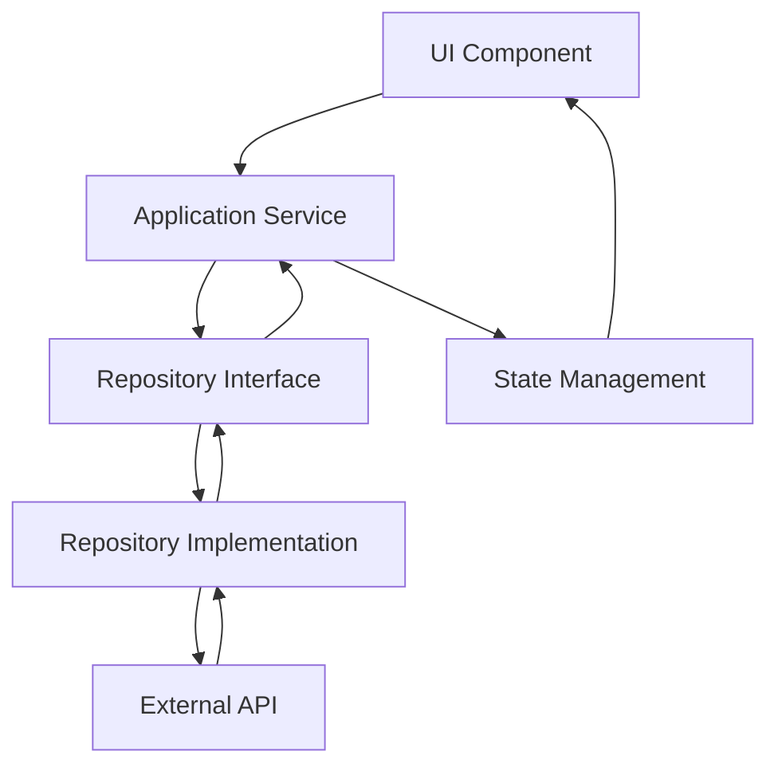

# Architecture Overview

## Introduction

AtomChat Frontend implements a simplified hexagonal architecture pattern, also known as Clean Architecture. This approach provides clear separation of concerns, making the codebase maintainable, testable, and scalable.

## Architectural Principles

### 1. Dependency Inversion
- High-level modules don't depend on low-level modules
- Both depend on abstractions (interfaces)
- Abstractions don't depend on details

### 2. Separation of Concerns
- Each layer has a single responsibility
- Clear boundaries between layers
- Minimal coupling between components

### 3. Single Source of Truth
- Centralized state management
- Consistent data flow
- Predictable application behavior

## Layer Structure

### Domain Layer (`/domain`)
**Purpose**: Contains business logic and entities

**Responsibilities**:
- Define business entities and their behaviors
- Establish repository interfaces
- Implement business rules and validations
- No external dependencies

**Key Components**:
- `entities/`: Business objects (User, Task, AuthState, etc.)
- `repositories/`: Interface contracts for data access

### Application Layer (`/application`)
**Purpose**: Orchestrates business logic and manages application state

**Responsibilities**:
- Implement use cases and business workflows
- Manage application state using RxJS
- Coordinate between domain and infrastructure
- Handle application-level logic

**Key Components**:
- `services/`: Application services that orchestrate business logic

### Infrastructure Layer (`/infrastructure`)
**Purpose**: Implements external concerns and data persistence

**Responsibilities**:
- Implement repository interfaces
- Handle HTTP communication
- Manage external service integrations
- Configure dependency injection

**Key Components**:
- `repositories/`: Concrete implementations of repository interfaces
- `providers/`: Dependency injection configuration

### Interfaces Layer (`/interfaces`)
**Purpose**: User interface and presentation logic

**Responsibilities**:
- Render user interface
- Handle user interactions
- Manage component state
- Format data for presentation

**Key Components**:
- `components/`: Angular components and pages

### Core Layer (`/core`)
**Purpose**: Shared services and cross-cutting concerns

**Responsibilities**:
- Provide shared utilities and services
- Implement interceptors and guards
- Manage global configuration
- Handle cross-cutting concerns

**Key Components**:
- `services/`: Shared services (Toast, Loading)
- `interceptors/`: HTTP interceptors
- `guards/`: Route guards
- `models/`: Shared models and interfaces

## Data Flow



### Flow Description

1. **User Interaction**: User interacts with UI component
2. **Application Service**: Component calls application service method
3. **Repository Interface**: Service uses repository interface
4. **Repository Implementation**: Interface implemented by infrastructure layer
5. **External API**: Repository makes HTTP request to backend
6. **State Update**: Response updates application state
7. **UI Update**: State change triggers UI re-render

## State Management

### Application State Pattern
Each application service manages its own state using RxJS BehaviorSubjects:

```typescript
interface TaskState {
    tasks: Task[];
    isLoading: boolean;
    error: string | null;
}

class TaskApplicationService {
    private stateSubject = new BehaviorSubject<TaskState>(initialState);
    public readonly state$ = this.stateSubject.asObservable();
}
```

### Benefits
- **Predictable**: State changes are explicit and traceable
- **Reactive**: Components automatically update when state changes
- **Testable**: State can be easily tested in isolation
- **Scalable**: Easy to add new state properties

## Dependency Injection

### Token-Based Injection
Services use injection tokens for loose coupling:

```typescript
// Domain layer defines interface
export interface TaskRepository {
    findAll(userId: string): Observable<Task[]>;
}

// Infrastructure provides implementation
export const TASK_REPOSITORY = new InjectionToken<TaskRepository>('TaskRepository');

// Application service injects interface
constructor(@Inject(TASK_REPOSITORY) private taskRepository: TaskRepository) {}
```

### Provider Configuration
Infrastructure providers are configured in `app.config.ts`:

```typescript
providers: [
    ...TASK_INFRASTRUCTURE_PROVIDERS,
    ...AUTH_INFRASTRUCTURE_PROVIDERS,
]
```

## Benefits of This Architecture

### 1. Maintainability
- Clear separation of concerns
- Easy to locate and modify code
- Consistent structure across features

### 2. Testability
- Each layer can be tested in isolation
- Dependencies can be easily mocked
- Clear interfaces for testing

### 3. Scalability
- Easy to add new features
- Minimal impact when modifying existing features
- Consistent patterns across the application

### 4. Flexibility
- Easy to swap implementations
- Technology-agnostic domain layer
- Adaptable to changing requirements

## Comparison with Traditional Angular Architecture

### Traditional Approach
```
components/
├── feature1/
│   ├── feature1.component.ts
│   ├── feature1.service.ts
│   └── feature1.model.ts
└── feature2/
    ├── feature2.component.ts
    ├── feature2.service.ts
    └── feature2.model.ts
```

**Issues**:
- Scattered business logic
- Duplicate code across features
- Tight coupling between layers
- Difficult to maintain consistency

### Hexagonal Approach
```
domain/entities/          # All entities in one place
application/services/     # All business logic centralized
infrastructure/repositories/ # All external implementations
interfaces/components/    # All UI components
```

**Benefits**:
- Centralized business logic
- Consistent patterns
- Clear boundaries
- Easy to maintain

## Best Practices

### 1. Layer Dependencies
- Domain layer should have no dependencies
- Application layer depends only on domain
- Infrastructure layer implements domain interfaces
- Interfaces layer depends on application layer

### 2. State Management
- Use BehaviorSubjects for state management
- Keep state immutable
- Handle loading and error states
- Provide clear state selectors

### 3. Error Handling
- Centralized error handling in interceptors
- User-friendly error messages
- Proper error logging
- Graceful degradation

### 4. Testing Strategy
- Unit test each layer independently
- Mock external dependencies
- Test state management
- Integration tests for complete workflows

## Migration Notes

This architecture was migrated from a feature-based hexagonal structure to a monolithic hexagonal structure for improved maintainability and consistency with the backend architecture.

### Key Changes
- Centralized entities in `domain/entities`
- Centralized repositories in `domain/repositories`
- Centralized services in `application/services`
- Centralized implementations in `infrastructure/`
- Centralized components in `interfaces/components`

The migration maintains all architectural benefits while providing a simpler, more maintainable structure.
